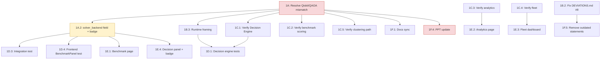

# GreenRoute — Hackathon Master Plan v3
## Execution Plan with Ownership, Dependencies, Freeze Dates & Risk

> **Hackathon:** July 30–31 (36 Hours)
> Supersedes v2. Same technical content, restructured so it functions as an
> actual project tracker: every task has an owner, a dependency, a risk
> level, and a hard date it must be done by. Section 8 is a standalone
> one-page checklist — print it, pin it, use it for daily stand-ups.

---

# 0. Role Key (map to your actual 4 team members)

| Role tag | Owns |
|---|---|
| **QL** — Quantum/Algorithms Lead | `qaoa_solver.py`, `qubo.py`, `decision_engine.py`, benchmark scoring logic |
| **BE** — Backend Lead | API routes, `dataset.py`, `ortools_solver.py`, `main.py`, dependencies, `repair.py` |
| **FE** — Frontend Lead | React pages/components, `AppContext`, API service layer |
| **PM** — Docs & Presentation Lead | `DEVIATIONS.md`, README, deck, demo script, judge Q&A prep, backup materials |

Tasks needing two people list both — the first name is the driver, the second
reviews/unblocks.

---

# 1. Freeze Dates (new — hard boundaries, not soft targets)

| Freeze | Date | Meaning |
|---|---|---|
| **Engineering Freeze** | **July 24, end of day** | All backend/frontend logic changes must be in by here. After this, only bug fixes surfaced by testing (§1D) are allowed — no new endpoints, no new components, no algorithm changes. |
| **Feature Freeze** | **July 27, end of day** | All Phase 2 polish (animations, charts, UX copy) must be in by here. After this, only visual bug fixes. |
| **Content Freeze** | **July 29, evening** | Deck, demo script, benchmark table, and all 7 demo datasets are locked. No new slides, no new numbers, no "let me just tweak one thing" the night before. |
| **Hackathon Start** | **July 30** | Only Phase 4 activity from here: fix bugs, validate, present. |

**Why this matters more than it looks like it does:** the single highest-risk
item in this whole plan (§2, 1A) has an uncertain outcome — Path A might not
work. The Engineering Freeze is what forces the Path A/B decision to actually
get made by July 24 instead of drifting to July 29, which is the failure mode
that would leave you with neither path fully working.

---

# 2. Phase 1 — Engineering Completion (Now → July 24, Engineering Freeze)

## 2A. Score-blocking — do this before anything else in this phase

| ID | Task | Owner | Depends on | Risk | Effort |
|---|---|---|---|---|---|
| **1A** | Resolve Qiskit/QAOA vs. documentation mismatch — Path A (real QAOA) or Path B (honest reframe) | **QL** (drive), PM (review deck impact) | none — start immediately | 🔴 **High** — Path A's outcome is genuinely uncertain; this is the one task in the whole plan that could blow the timeline | Path A: 4–6h (uncertain) / Path B: 1–2h |
| **1A.2** | Add `solver_backend` field to `/api/quantum` + `/api/benchmark`; surface as a badge in `DecisionEnginePanel` | **BE** (field) + **FE** (badge) | 1A must be *decided* (not necessarily finished) — the field's possible values depend on which path was taken | 🟢 Low | 45 min |

**1A decision rule:** timebox Path A to 4 hours from when you start. If no
working Qiskit version combination is found by then, stop and execute Path B
completely rather than limping toward a partial Path A past the freeze date.

**1A.2 detail:** `"solver_backend": "qiskit_qaoa"` or
`"solver_backend": "simulated_annealing"` — this is the cheapest, highest-
leverage fix in the entire plan. Do not skip it regardless of which path 1A
resolves to.

## 2B. Correctness bugs — small, specific, independent of each other

| ID | Task | Owner | Depends on | Risk | Effort |
|---|---|---|---|---|---|
| **1B.1** | Fix `runs: 5` vs. actual 6-restart mismatch in `qaoa_solver.py` / API response | **QL** | none | 🟢 Low | 15 min |
| **1B.2** | Correct `DEVIATIONS.md` #8 (claims per-route fuel/CO₂; code only returns fleet aggregates) | **PM** | none | 🟢 Low | 10 min |
| **1B.3** | Recheck Decision Engine runtime framing — OR-Tools (2.0s) currently slower than SA (0.14s), backwards from `_explain()`'s assumption | **QL** | 1A resolved (wording may need to reference `solver_backend`) | 🟡 Medium — easy to fix, easy to forget | 30 min |
| **1B.4** | Pin exact dependency versions in `requirements.txt` (currently loose `>=` ranges — the direct cause of 1A's bug) | **BE** | none | 🟢 Low | 20 min |

These four have no dependency on each other — assign to whoever's free,
in parallel, same day.

## 2C. Verification — confirm existing work is real

| ID | Task | Owner | Depends on | Risk | Effort |
|---|---|---|---|---|---|
| **1C.1** | Verify Decision Engine outputs (tie/infeasible/missing-data) by hand once, then hand off to 1D's automated tests | **QL** | 1A, 1B.3 | 🟢 Low | 30 min |
| **1C.2** | Verify benchmark scoring end-to-end against a known dataset | **QL** + **BE** | 1A | 🟢 Low | 20 min |
| **1C.3** | Verify analytics endpoint partial-state (`null` sections) behavior | **BE** | none | 🟢 Low | 20 min |
| **1C.4** | Verify fleet endpoint math by hand | **BE** | none | 🟢 Low | 15 min |
| **1C.5** | Verify clustering path (Medium/Large tiers) actually executes in `/api/quantum`, not just the frontend notice — run `sample_medium.csv` + `test_large.csv` through the full pipeline | **BE** + **QL** | 1A | 🟡 **Medium** — unverified as of last review; could reveal clustering was never fully wired in | 30–60 min |

## 2D. Testing — minimum viable set, in this order

| ID | Task | Owner | Depends on | Risk | Effort |
|---|---|---|---|---|---|
| **1D.1** | `test_decision_engine.py` — tie, infeasible, missing-data cases | **QL** | 1A, 1B.3 (test against final behavior, not pre-fix behavior) | 🟢 Low | 45 min |
| **1D.2** | `test_qubo.py` — variable count + constraint sanity | **QL** | none | 🟢 Low | 30 min |
| **1D.3** | `TestClient` integration test — full pipeline, 200 + expected keys at each step | **BE** | 1A, 1A.2 (assert `solver_backend` field present) | 🟢 Low | 45 min |
| **1D.4** | Frontend test — `BenchmarkPanel` tie + infeasible rendering | **FE** | 1A.2 (badge must exist to test) | 🟢 Low | 30 min |

**Do these four before starting §2E/§2F below** — they're the safety net for
everything else, and they're cheap.

## 2E. Frontend completion

| ID | Task | Owner | Depends on | Risk | Effort |
|---|---|---|---|---|---|
| **1E.1** | Finish Benchmark page | **FE** | 1A.2 | 🟢 Low | — |
| **1E.2** | Finish Analytics page | **FE** | 1C.3 | 🟢 Low | — |
| **1E.3** | Fleet Dashboard | **FE** | 1C.4 | 🟢 Low | — |
| **1E.4** | Decision Engine panel incl. `solver_backend` badge | **FE** | 1A.2 | 🟢 Low | — |
| **1E.5** | Error handling, loading states, responsive layout | **FE** | none | 🟢 Low | — |

## 2F. Documentation sync

| ID | Task | Owner | Depends on | Risk | Effort |
|---|---|---|---|---|---|
| **1F.1** | Backend + frontend docs synchronized | **PM** | 1A resolved | 🟢 Low | — |
| **1F.2** | API documentation updated | **PM** + **BE** | 1A.2 | 🟢 Low | — |
| **1F.3** | README updated | **PM** | 1A resolved | 🟢 Low | — |
| **1F.4** | PPT updated to match Path A/B decision | **PM** | **1A — cannot start until this is resolved** | 🔴 **High if 1A slips** — this is the task most likely to get rushed if 1A runs long | — |
| **1F.5** | Remove outdated statements incl. the 1B.2 correction | **PM** | 1B.2 | 🟢 Low | — |

## Dependency Graph — Phase 1 critical path

**Reading this:** almost everything in Phase 1 flows from 1A. This is
intentional, not a design flaw in the plan — it reflects reality: until the
quantum/documentation question is resolved, nothing downstream (tests,
verification, docs, the deck) can be finalized without risk of redoing it.
This is why 1A has no dependencies and should start the moment Phase 1 opens.

### Deliverable

By **July 24 (Engineering Freeze)**: feature complete *and* honest — every
claim in the code, docs, and deck agrees with what actually runs.

---

# 3. Phase 2 — Demo Polish (July 25–27, Feature Freeze)

| ID | Task | Owner | Depends on | Risk | Effort |
|---|---|---|---|---|---|
| 2.1 | Better animations, route playback, loading indicators | **FE** | Phase 1 complete | 🟢 Low | — |
| 2.2 | Improved charts, better map styling, KPI cards | **FE** | Phase 1 complete | 🟢 Low | — |
| 2.3 | Better error messages, tooltips, progress indicators | **FE** | Phase 1 complete | 🟢 Low | — |
| 2.4 | Icons, typography, spacing, color palette, route colors | **FE** | Phase 1 complete | 🟢 Low | — |

**Gate:** do not start Phase 2 until every Phase 1 row is checked off in §8.
Polishing UI on top of an unresolved 1A is wasted work if Path A/B changes
what the UI needs to show.

---

# 4. Phase 3 — Presentation Readiness (July 28–29, Content Freeze)

| ID | Task | Owner | Depends on | Risk | Effort |
|---|---|---|---|---|---|
| 3.1 | Rehearse demo script (5-min / 10-min / technical versions) | **PM** + whole team | 1F.4, Phase 2 | 🟡 Medium — rehearsal often gets compressed; protect this time explicitly | — |
| 3.2 | Prepare + verify all 7 demo datasets | **BE** + **QL** | 1C.5 | 🟡 Medium — Quantum Wins / Classical Wins pairing must both be scripted, not just present in the repo | — |
| 3.3 | Judge Q&A prep, incl. the two QAOA-specific questions from 1A | **PM** + **QL** | 1A resolved | 🔴 **High if skipped** — "walk me through your QAOA circuit" is the single most likely hard question given 1A | — |
| 3.4 | Benchmark table with Solver Backend column filled in | **PM** | 3.2, 1A.2 | 🟢 Low | — |
| 3.5 | Failure recovery plans (backend crash, API timeout, solver failure, no internet) | **BE** + **PM** | 1A (confirm SA fallback engages if Path A's real QAOA raises at runtime) | 🟡 Medium | — |
| 3.6 | Backup material: screenshots, recorded video, sample outputs | **PM** + **FE** | Phase 2 complete | 🟢 Low | — |

**Demo script order (unchanged):** Upload → Configure Fleet → Run Classical →
Run Quantum (**state `solver_backend` plainly here**) → Benchmark → Decision
Engine → Analytics → Sustainability Summary.

---

# 5. Phase 4 — Hackathon Execution (July 30–31)

| Priority | Task | Owner | Risk |
|---|---|---|---|
| First | Fix bugs, validate outputs, run smoke tests | whole team | 🟢 Low if Phases 1–3 complete |
| Second | UI polish, documentation updates, presentation refinement | **FE** + **PM** | 🟢 Low |
| **Avoid** | Major architecture redesign, new algorithms, large refactoring, new dependencies, **reopening the 1A decision** | — | 🔴 reopening 1A here is the single worst thing that could happen in this phase |

---

# 6. Optional Enhancements (only if every phase above is fully checked off)

| Task | Risk if attempted early |
|---|---|
| Live optimization timeline, route replay animation, interactive QUBO inspector | 🟢 Low — safe, additive |
| Metrics history, export benchmark reports, health dashboard | 🟢 Low |
| Plugin-ready solver interface | 🟡 Medium — architecture change, easy to justify skipping |
| Real per-vehicle-type emissions model | 🟡 Medium — multi-hour backend + frontend work, only with real time to spare |
| CI pipeline running §2D's tests on every commit | 🟢 Low — worth it only once the tests exist |

---

# 7. Risk Register (execution risks, not technical risks — see `path_to_10.md` for the latter)

| Risk | Likelihood | Impact | Mitigation |
|---|---|---|---|
| Path A (real QAOA) doesn't converge to a working version combo in time | Medium | High | Hard 4-hour timebox (§2A); Path B fully scoped and ready to execute immediately on timeout |
| 1F.4 (PPT update) gets rushed because 1A ran long | Medium | High | 1A's timebox exists specifically to protect this; PM should start drafting both Path A and Path B versions of the affected slides in parallel with 1A, not after |
| Clustering path (1C.5) turns out to be unwired, discovered late | Low–Medium | Medium | Scheduled early in Phase 1 (§2C), not deferred to Phase 3 |
| Team member unavailable / task orphaned | Unknown | Medium | Every task above has exactly one primary owner — reassign visibly in §8 if someone drops, don't let a task silently stall |
| Demo rehearsal (3.1) gets compressed by Phase 1 overrun | Medium | High | Content Freeze (July 29) is a hard date specifically to protect rehearsal time; if Phase 1 slips past July 24, cut Phase 2 polish, not Phase 3 rehearsal |
| Judge asks the QAOA-circuit question and the answer isn't rehearsed | Medium | High | §4, 3.3 — scripted, not improvised |

---

# 8. One-Page Execution Checklist

*(Print this section. Update daily. Owner initials in the blank, risk flags
carried over from above.)*

## Freeze dates
- [ ] **Engineering Freeze — July 24**
- [ ] **Feature Freeze — July 27**
- [ ] **Content Freeze — July 29**

## Phase 1 (Now → July 24)
- [ ] 1A — Resolve Qiskit/QAOA mismatch (Path A/B) — 🔴 — Owner: ______ — Done: ___
- [ ] 1A.2 — `solver_backend` field + UI badge — 🟢 — Owner: ______ / ______ — Done: ___
- [ ] 1B.1 — Fix `runs` count mismatch — 🟢 — Owner: ______ — Done: ___
- [ ] 1B.2 — Fix `DEVIATIONS.md` #8 — 🟢 — Owner: ______ — Done: ___
- [ ] 1B.3 — Fix runtime framing — 🟡 — Owner: ______ — Done: ___
- [ ] 1B.4 — Pin dependency versions — 🟢 — Owner: ______ — Done: ___
- [ ] 1C.1–1C.4 — Verify Decision Engine / benchmark / analytics / fleet — 🟢 — Owner: ______ — Done: ___
- [ ] 1C.5 — Verify clustering path (medium + large datasets) — 🟡 — Owner: ______ — Done: ___
- [ ] 1D.1–1D.4 — Four minimum-viable tests — 🟢 — Owner: ______ — Done: ___
- [ ] 1E.1–1E.5 — Frontend completion — 🟢 — Owner: ______ — Done: ___
- [ ] 1F.1–1F.5 — Docs + PPT sync — 🔴 (1F.4) — Owner: ______ — Done: ___

## Phase 2 (July 25–27) — gate: Phase 1 fully checked above
- [ ] UI polish (animations, charts, map, KPI cards) — Owner: ______
- [ ] UX polish (errors, tooltips, spacing) — Owner: ______
- [ ] Visual polish (icons, typography, colors) — Owner: ______

## Phase 3 (July 28–29) — gate: Phase 2 fully checked above
- [ ] Demo script rehearsed (5/10/technical) — 🟡 — Owner: ______
- [ ] 7 demo datasets verified + scripted — 🟡 — Owner: ______
- [ ] Judge Q&A prepped, incl. QAOA question — 🔴 — Owner: ______
- [ ] Benchmark table finalized w/ Solver Backend column — Owner: ______
- [ ] Failure recovery plans confirmed — 🟡 — Owner: ______
- [ ] Backup material (screenshots, video) ready — Owner: ______

## Phase 4 (July 30–31)
- [ ] Bugs only. Do **not** reopen 1A. — 🔴 if violated

## Legend
🔴 High risk — check daily, escalate immediately if slipping
🟡 Medium risk — check every 2 days
🟢 Low risk — check once, move on

# End
