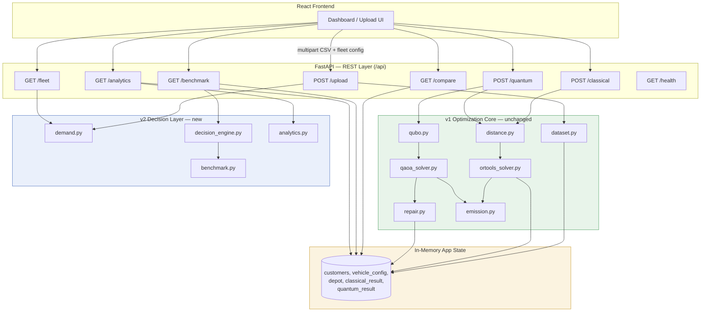
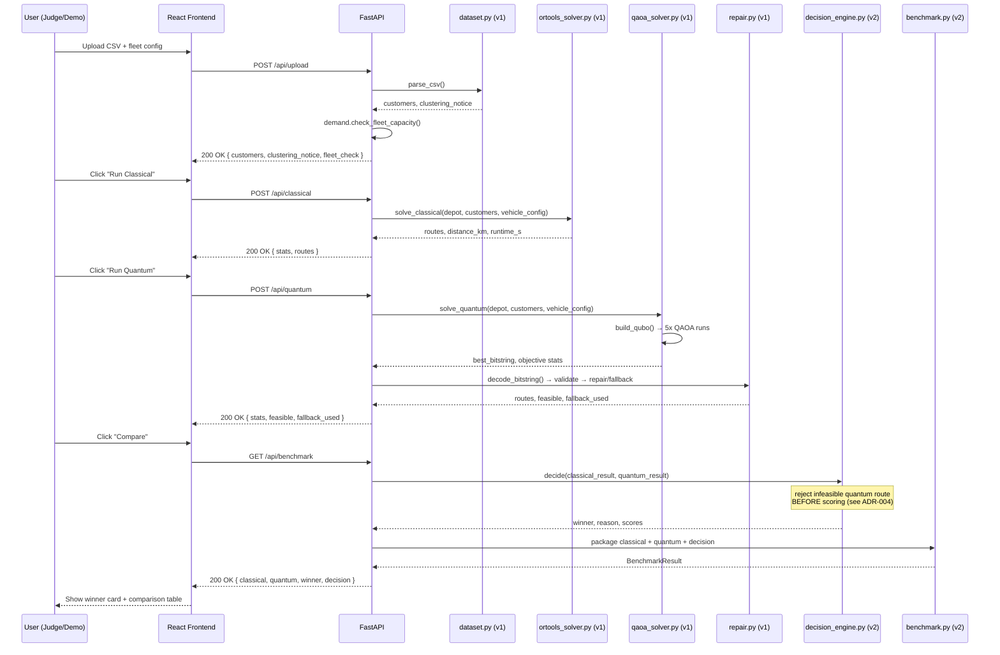
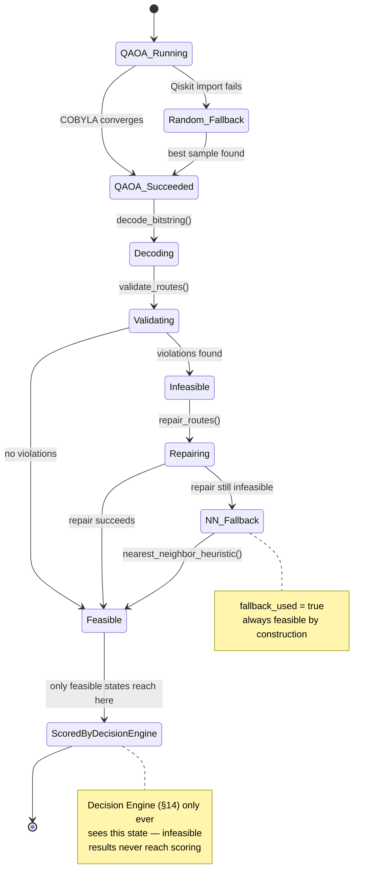
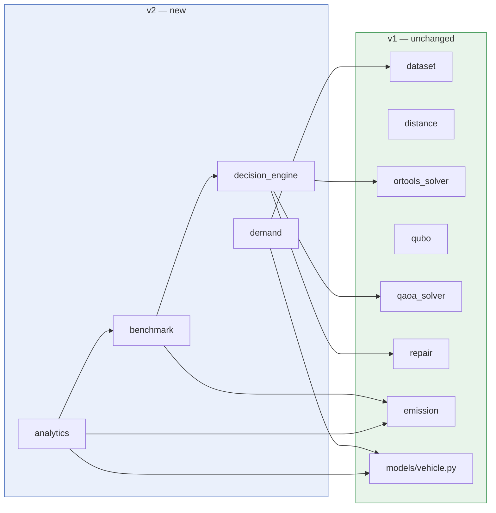
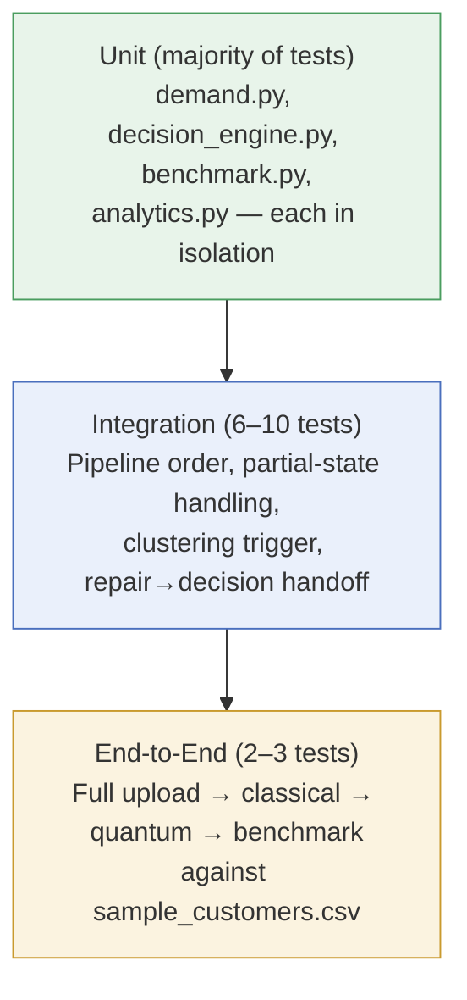

# backend_v2.md — Part 3
## Visual Architecture, ADRs, Testing & Configuration

> Continuation of Parts 1–2. Version 2.1.
> Part 1–2 defined *what* to build and *why the previous drafts were wrong*.
> Part 3 gives the diagrams and engineering artifacts a team would actually
> keep in a repo: system/sequence/state/dependency diagrams, ADRs for the
> decisions already made, a testing strategy, and the configuration surface.

---

# 23. System Architecture Diagram



**Reading this diagram:** the green box is v1 and is not touched. The blue box is
everything new in v2, and every new box only *reads* from the shared state
that v1 already writes to (`app.state.classical_result`, `app.state.quantum_result`,
etc.) — nothing new in v2 requires v1's solver functions to change their return
shapes.

---

# 24. Sequence Diagram — Full Demo Flow



---

# 25. State Diagram — Quantum Solve Lifecycle



---

# 26. Dependency Diagram — v2 Services on v1 Core



**Why this matters for the 36 hours:** every arrow points from v2 into v1, never
the reverse. No v1 file needs to import anything from `services/decision_engine.py`,
`benchmark.py`, or `analytics.py`. That means v2 work can proceed on a branch (or
in parallel by a second team member) without ever touching a file the other
person is actively editing — the dependency graph *is* the merge-conflict
avoidance plan.

---

# 27. Architecture Decision Records (ADRs)

Each ADR captures one decision already made across Parts 1–2, in the standard
Context / Decision / Consequences format, so the reasoning survives past this
document into the actual repo (`docs/adr/NNN-title.md` is the conventional
location if you want to split these out).

---

### ADR-001: Keep the assignment-variable QUBO encoding; do not adopt arc-variables

**Status:** Accepted

**Context:** An earlier draft of this architecture proposed an arc-variable
encoding `x(i,j,v)`, scaling as O(N²×K). The working v1 implementation instead
uses assignment-variables `y(i,k)`, scaling as O(N×K), with route ordering
resolved afterward via nearest-neighbor cost estimation rather than MTZ
subtour-elimination variables.

**Decision:** Keep `y(i,k)`. Do not implement `x(i,j,v)` for this event.

**Consequences:**
- ✅ QAOA stays within the local Aer simulator's practical qubit budget
  (tested up to 24 variables / 8 customers × 3 vehicles).
- ✅ No MTZ subtour-elimination constraints needed, simplifying the QUBO and
  removing a whole class of penalty-weight tuning problems.
- ⚠️ Route-cost estimation via nearest-neighbor is an approximation, not an
  exact TSP cost — acceptable for MVP-scale demo instances, revisit if larger
  instances or exact costing become a requirement.
- 🔭 Arc-variable encoding remains a legitimate future direction for real IBM
  Quantum hardware runs at larger scale (§21), not for this event.

---

### ADR-002: QAOA customer limit fixed at 8, not 15

**Status:** Accepted

**Context:** An earlier draft set the "pure QAOA" threshold at <15 customers.
The actual solver enforces `QAOA_CUSTOMER_LIMIT = 8` and hard-rejects any QUBO
with more than 24 variables.

**Decision:** All hybrid-strategy tiering (§13) uses 8 as the real ceiling for
whole-instance QAOA. Anything larger is clustered first.

**Consequences:**
- ✅ The three-tier strategy (Small/Medium/Large) now routes real datasets
  correctly instead of sending 9–14 customer datasets into a solver that
  immediately raises `ValueError`.
- ⚠️ The "pure QAOA" tier is narrower than originally hoped — most demo
  datasets above trivial size will hit the clustered path. This should be
  stated plainly during the demo rather than downplayed.

---

### ADR-003: Decision Engine scores only distance and runtime, normalized

**Status:** Accepted

**Context:** The original scoring formula weighted distance, fuel, CO₂, and
runtime independently. Because `fuel = distance × rate` and `co2 = fuel ×
factor` under the current single-blended-rate fleet model, this counted the
same underlying signal three times at different unit scales, and mixed raw
units (km/L/kg/s) without normalization.

**Decision:** Score on two independently-varying signals — distance and
runtime — each min-max normalized to `[0, 1]` across the two candidates before
weighting (0.75 / 0.25 split, distance favored since it's the primary
optimization target). Fuel and CO₂ remain fully reported in `/compare`,
`/benchmark`, and the dashboard; they are excluded only from the *decision
score* itself.

**Consequences:**
- ✅ Scores are dimensionless, comparable, and don't silently amplify one
  metric via double-counting.
- ✅ Ties are handled explicitly (`hi == lo` → both score 1.0 on that metric)
  instead of producing a `ZeroDivisionError` or an arbitrary winner.
- ⚠️ If a future version supports per-route vehicle-type variation (e.g. one
  solution favors more Electric Vans than the other), fuel/CO₂ could start
  varying independently of distance, and this ADR should be revisited (see
  §21, §16).

---

### ADR-004: Repair runs before the Decision Engine sees the quantum result

**Status:** Accepted

**Context:** Two places in an earlier draft disagreed on ordering — one diagram
showed Decision Engine before Repair, the numbered pipeline showed the reverse.
Scoring an unrepaired, potentially infeasible QAOA bitstring against OR-Tools'
always-feasible output is not a meaningful comparison.

**Decision:** Repair/fallback (v1, unchanged) always completes before the
Decision Engine runs. This is now the single canonical order, stated once in
Part 1 §8 and mirrored exactly in Part 2 §22.

**Consequences:**
- ✅ The Decision Engine only ever operates on feasible routes, matching the
  state diagram in §25.
- ✅ Eliminates an entire category of "why did quantum win with an invalid
  route" demo failure.

---

### ADR-005: No `OptimizationContext` god-object this event

**Status:** Accepted (revisit post-event)

**Context:** A single shared context object touched by every service was
proposed to reduce parameter-passing. Implementing it now would require
changing the signatures of every existing v1 service function — high risk,
given v1 is tested and working, for a refactor with no judge-visible payoff.

**Decision:** New v2 services take the specific v1 result objects they need as
plain arguments and return small, typed dataclasses (`DecisionResult`,
`BenchmarkResult`). No shared god-object this round.

**Consequences:**
- ✅ Zero changes required to any v1 function signature.
- ✅ New v2 services can be built and tested in isolation (see §28).
- ⚠️ Slightly more parameter-passing than a unified context would need — an
  acceptable, explicit tradeoff given the 36-hour constraint. Revisit as a
  code-quality pass after the event if the team wants it (§21).

---

### ADR-006: Drop the `/api/simulate` endpoint

**Status:** Accepted

**Context:** `/api/simulate` was proposed as a new endpoint but its behavior —
run classical, run quantum, then compare — is already fully covered by calling
the three existing endpoints in sequence.

**Decision:** Do not implement `/api/simulate` as a new pipeline. If a single
"run everything" convenience action is wanted for the demo UI, implement it as
a thin frontend-side helper that calls `/classical` → `/quantum` → `/benchmark`
in sequence, or a backend route that does the same three calls internally with
no new logic of its own.

**Consequences:**
- ✅ One less pipeline to build, test, and keep in sync with the real ones.
- ✅ No duplicated business logic that could drift from the actual solvers.

---

# 28. Testing Strategy

## 28.1 Test Pyramid for the 36-Hour Scope



Most new v2 logic is small, pure functions (`normalize()`, `check_fleet_capacity()`,
`score_candidate()`) — these are cheap to unit test exhaustively and should be,
since the Decision Engine's correctness is the centerpiece of the demo.

## 28.2 Required Test Cases (new, v2-specific)

**`decision_engine.py`:**
- Quantum strictly better on both distance and runtime → quantum wins, both
  normalized scores at their expected values.
- Quantum better on distance, worse on runtime → verify the 0.75/0.25 weighting
  produces the expected winner (test both a case where quantum still wins and
  a constructed case where it doesn't, to prove the weight is actually applied).
- Exact tie on distance and runtime → both scores equal (regression test for
  the `hi == lo` branch in `normalize()`).
- Quantum infeasible even after repair/fallback → classical wins automatically,
  `quantum_score == 0.0`, without calling `normalize()` at all (this path must
  short-circuit — repair/fallback in v1 makes `feasible=False` rare, but
  `decision_engine.py` must not assume it can't happen).
- Classical result missing entirely (only quantum has run) → should raise a
  clear error or return a "not enough data" response, not crash on a
  `KeyError`.

**`demand.py`:**
- Capacity exactly equal to demand → `sufficient: true`, `utilization_pct: 100.0`.
- Zero total capacity (misconfigured fleet, all counts 0) → `utilization_pct:
  None`, not a `ZeroDivisionError`.
- Capacity below demand → `sufficient: false`, correct percentage.

**`benchmark.py` / `analytics.py`:**
- Only classical has run → `quantum` section is `null`, no crash (mirrors v1's
  existing `/api/compare` partial-state pattern — test that the pattern is
  actually preserved, since it's easy to accidentally regress).
- Both have run → full response matches the schema in Part 1 §7 exactly
  (a schema/contract test, not just a "does it run" smoke test).

## 28.3 Regression Tests Against v1 (run before *and* after every v2 change)

- `POST /api/upload`, `POST /api/classical`, `POST /api/quantum`,
  `GET /api/compare` — existing v1 test suite must pass unmodified. This is
  the concrete, checkable version of ADR-004 and §0's non-negotiable
  constraint: if any of these break, the causing v2 change is reverted, not
  patched around.
- QAOA customer/qubit limits (`QAOA_CUSTOMER_LIMIT = 8`, `n_vars > 24` reject)
  — assert these constants are unchanged, since ADR-002 depends on them.

## 28.4 What *not* to test this round

- Load/performance testing (single-user local demo, not a production service).
- IBM Quantum hardware integration tests (out of scope, §21).
- Exhaustive fuzz testing of CSV parsing edge cases beyond what v1 already
  covers — v1's `dataset.py` validation is unchanged and already tested.

---

# 29. Configuration

## 29.1 Configuration Surface (minimal, per §18)

```python
# app/config.py — single file, not a package, for this event's scope

# Re-exported from qaoa_solver.py so other v2 modules have one place to import
# from, without creating a circular import back into the solver itself.
from app.services.qaoa_solver import QAOA_CUSTOMER_LIMIT  # = 8

DEBUG: bool = False

# Decision Engine weights (ADR-003) — kept configurable, not hardcoded inline,
# so the weighting can be tuned during Day 1 without touching decision_engine.py
DECISION_DISTANCE_WEIGHT: float = 0.75
DECISION_RUNTIME_WEIGHT:  float = 0.25
assert abs(DECISION_DISTANCE_WEIGHT + DECISION_RUNTIME_WEIGHT - 1.0) < 1e-9
```

## 29.2 Environment Variables

| Variable | Default | Purpose | In scope this event? |
|---|---|---|---|
| `DEBUG` | `false` | Toggle verbose logging for demo troubleshooting | ✅ Yes |
| `CORS_ORIGINS` | `http://localhost:3000` | Already exists in v1's `main.py`; documented here for completeness, not changed | ✅ Yes (unchanged) |
| `SIMULATOR` | n/a | Proposed in an earlier draft to select a quantum backend | ❌ No — only one simulator target exists (Aer); this variable would have nothing to switch between |
| `IBM_BACKEND` | n/a | Proposed for IBM Quantum hardware selection | ❌ No — hardware integration is §21 future scope; adding this variable now would be dead configuration |
| `MAX_QAOA_DEPTH` | n/a | Proposed to make QAOA layer count (p) configurable | ❌ No — v1's `QAOA_LAYERS = 3` is already tuned and stable; making it env-configurable adds a support surface (untested layer counts) without a driving need this event |

The right-hand column is deliberate: every environment variable in a hackathon
codebase is something a teammate can set wrong five minutes before the demo.
Only add one when something in the code actually branches on it.

## 29.3 Per-Environment Behavior

There is exactly one environment for this event — local development, uvicorn
with `--reload`, Vite dev server on port 3000, FastAPI on port 8000, matching
the CORS configuration v1's `main.py` already has. No staging/production
distinction is needed and none should be built — see §19 for why deployment
concerns are explicitly deferred.

## 29.4 Feature Flags (informal, code-level only)

No feature-flag framework — at this scale, an `if` statement gated on a
constant in `config.py` is the entire feature-flag system needed:

```python
# Example: if clustering integration (§13) isn't finished in time,
# this single flag lets the rest of the demo run without it.
ENABLE_LIVE_CLUSTERING: bool = True   # set False to skip §13's Medium/Large
                                       # tiers and fall back to v1's existing
                                       # "clustering notice only" behavior
```

This is the kind of escape hatch worth having given the roadmap in §20 — if
clustering wiring runs out of time on Day 1, flipping this one constant lets
the demo degrade gracefully to "v1 behavior plus Decision Engine/Benchmark/
Analytics," which is still a strong demo, rather than a half-finished feature
causing a crash on stage.

---

# 30. End of Part 3

Parts 1–3 together are now internally consistent:

- Part 1: what to build, corrected pipeline order, corrected API surface
- Part 2: corrected QUBO/QAOA scope, corrected Decision Engine math, realistic
  roadmap
- Part 3: how it's visualized, why each key decision was made (ADRs), how it's
  tested, and what is and isn't configurable

Nothing in Part 3 introduces new scope — every diagram and section here
documents decisions already locked in Parts 1–2. That's intentional: the goal
is a repo that looks and reads like an engineering team's documentation, not
new work to squeeze into 36 hours.
