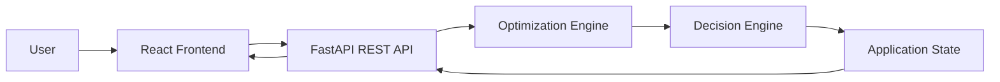
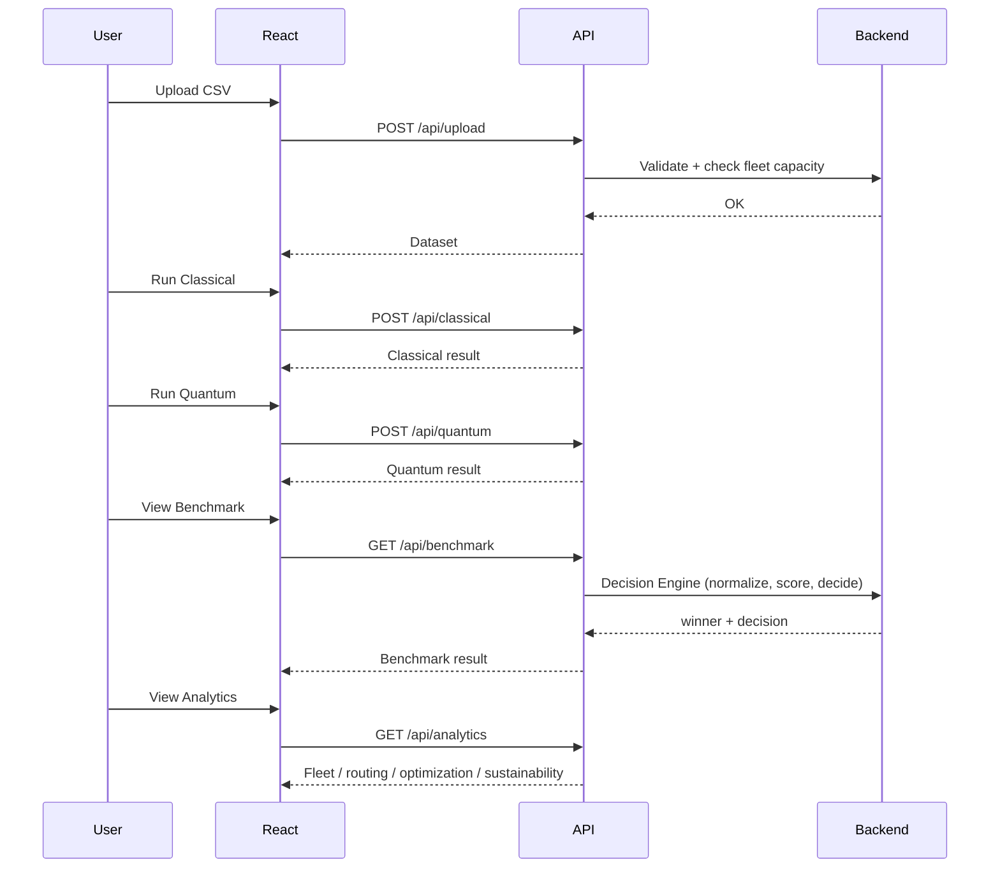
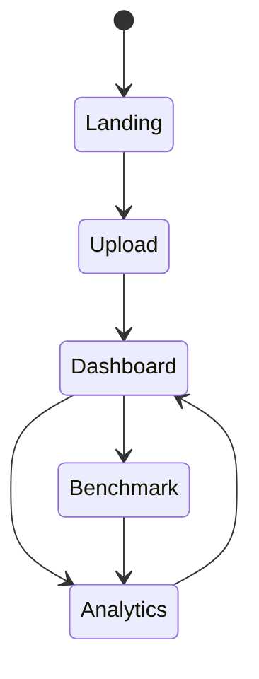

# frontend_v2.md — Part 3
# Engineering Documentation, Architecture & Deployment (corrected)

> Continuation of Parts 1–2

---

# 25. System Architecture



The frontend is responsible only for presentation and user interaction. All
optimization, scoring, and sustainability math remains on the backend.

---

# 26. Component Hierarchy

```text
App
│
├── Navbar                      (Home · Upload · Dashboard · Benchmark · Analytics)
│
├── Pages
│   ├── Landing
│   ├── Upload
│   ├── Dashboard
│   ├── Benchmark               [V2 — Planned]
│   └── Analytics               [V2 — Planned]
│
└── Shared Components
    ├── StatsCard
    ├── ErrorBanner
    ├── ComparisonTable
    ├── ResultChart              (Chart.js)
    ├── DecisionEnginePanel      [V2 — Planned]
    └── RouteMap                 (Leaflet)
```

No `Sidebar` or `Footer` component exists — corrected from the v2.1 draft's
hierarchy, which listed both under `Layout`.

---

# 27. Sequence Diagram



---

# 28. UI State Diagram



---

# 29. Architecture Decision Records

### ADR-001
Use React Context instead of Redux.

Reason:
- Smaller codebase
- Easier onboarding
- Sufficient for project size

### ADR-002
Backend owns all business logic.

Reason:
- Single source of truth
- Easier testing
- Thin frontend
- Directly prevents the Decision Engine / Green Score duplication problem
  described in §16 and §21 of Part 2

### ADR-003
Leaflet selected for route visualization.

Reason:
- Lightweight
- Open source
- React integration

### ADR-004 — new
**One `AppContext`, not three.**

Reason:
- The originally-planned `DatasetContext` / `OptimizationContext` /
  `ThemeContext` split was never built
- There is no theme feature to justify `ThemeContext`
- A single context is simpler to reason about at this app's size, and matches
  what actually shipped rather than a plan that stalled

### ADR-005 — new
**Reuse existing endpoints for the Scenario Simulator instead of a dedicated `/api/simulate`.**

Reason:
- `backend_v2.md` §7 already rejected `/api/simulate` as a duplicate pipeline
- Re-running `/api/upload → /api/classical → /api/quantum → /api/benchmark`
  with a modified `vehicleConfig` achieves the same result with zero new
  backend surface area

### ADR-006 — new
**Chart.js + react-chartjs-2, not Recharts.**

Reason:
- Already the installed dependency in the shipped codebase
- Recharts was never added; switching now has no functional benefit and only
  adds a second charting library to maintain

---

# 30. Testing Strategy

## Unit Tests

- Components
- Hooks
- Utility functions
- `DecisionEnginePanel` rendering all three states: normal, tie, infeasible

## Integration Tests

- API communication (including `/api/benchmark`'s 4xx precondition path)
- Routing
- Context updates

## End-to-End

- Upload
- Classical / Quantum runs
- Benchmark
- Analytics

---

# 31. Performance

Techniques

- Lazy loading
- React.memo
- useMemo
- useCallback
- Code splitting
- Image optimization

---

# 32. Accessibility

- Keyboard navigation
- ARIA labels
- Color contrast
- Screen reader friendly
- Focus indicators

---

# 33. Configuration

| Setting | Purpose |
|---------|---------|
| API_BASE_URL | Backend endpoint |
| MAP_PROVIDER | Tile server |
| ENABLE_ANIMATION | Route animation |

`DEFAULT_THEME` removed — no theme feature is scoped (see ADR-004, §21 of Part 1 routing table).

---

# 34. Error Handling

Recoverable errors

- API unavailable
- Timeout
- Invalid CSV
- Empty response
- `/api/benchmark` called before both solvers have run (expected precondition, not a bug)

UI actions

- Retry
- Toast notification
- Inline validation
- Loading skeletons
- Guided prompt back to the Dashboard when a Benchmark/Analytics precondition isn't met

---

# 35. Risk Register

| Risk | Mitigation |
|------|------------|
| Backend unavailable | Retry & notification |
| Large datasets | Progressive loading |
| Network latency | Loading indicators |
| Invalid upload | Validation |
| Frontend silently re-implements backend scoring and drifts out of sync | §16's rule: render `decision` verbatim, never recompute client-side |

---

# 36. Deployment

Development

```text
React (Vite)
        │
FastAPI (localhost)
```

Production

```text
React
   │
Nginx
   │
FastAPI
```

Future

- Docker
- Vercel
- CI/CD
- IBM Quantum integration

---

# 37. Future Roadmap

Phase 1
- Build the Benchmark page + Decision Engine panel (§15–16)
- Build the Analytics page (§17)
- Fleet capacity check on Upload (§12, §19)
- Live route playback
- Export reports

Phase 2
- Settings page — currently descoped (Part 1 §6); needs an actual design pass before it's built, not just a route stub
- Mobile interface
- Notifications
- Scenario Simulator UI (§20) on top of the existing re-run sequence

Phase 3
- Per-vehicle-type CO₂ breakdown in the backend, which would make a genuine
  Green Logistics Score possible (§21) — currently blocked on backend scope, not frontend effort
- Real-time GPS
- Traffic-aware routing
- IBM Quantum Runtime

---

# 38. Documentation Summary

Parts 1–3 together provide:

- Frontend architecture, corrected to match both the shipped codebase and
  `backend_v2.md`'s actual API surface
- UI design for Upload/Dashboard (shipped) and Benchmark/Analytics (planned)
- Component hierarchy without speculative components that were never built
- State management (single context)
- API integration mapped 1:1 to real backend endpoints
- Explicit call-outs for what's shipped, what's planned, and what's
  intentionally descoped — so nothing in here is mistaken for "already built"

The frontend is designed to remain modular, scalable, and fully aligned with
the backend_v2 architecture — including inheriting its corrections rather than
duplicating the flaws they fixed.

# End of frontend_v2.md
